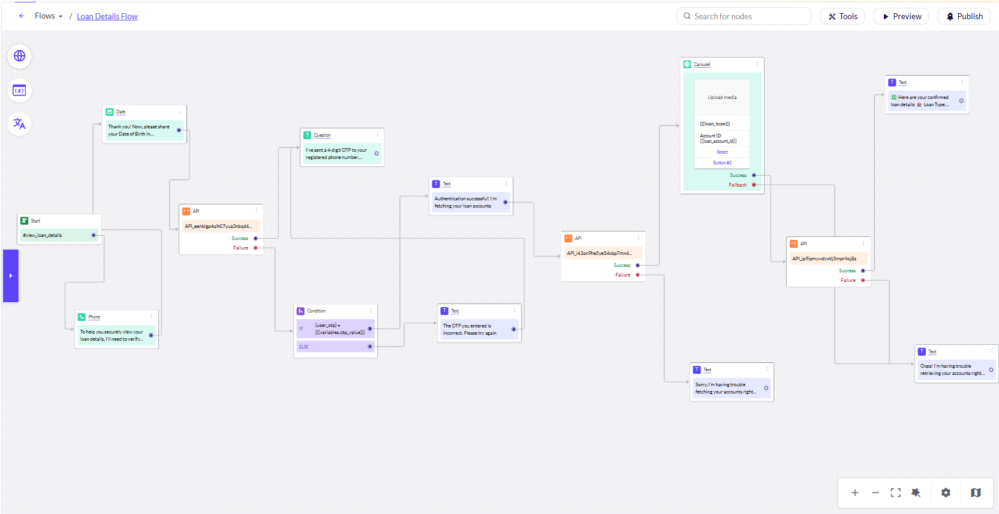

# Yellow Bank - Gen AI Banking Agent
A production-ready conversational AI agent built on the **Yellow.ai** platform. This agent orchestrates secure authentication and dynamic data retrieval for a mock banking ecosystem.

---

## The Assignment Brief
**Objective**: Design a Gen AI Banking Agent for "Yellow Bank" that facilitates secure access to loan details.

### Core Requirements:
1.  **Intent Recognition**: Identify requests like "I want to check my loan details."
2.  **Identity Verification**: Collect Phone Number and Date of Birth (DOB).
3.  **Secure OTP Flow**: Trigger a mock OTP via API and verify user input.
4.  **Workflow A (Discovery)**: Fetch Loan Account IDs and render them as interactive **Carousel Cards**.
5.  **Workflow B (Retrieval)**: Fetch raw technical details (interest rate, tenure, etc.) for the selected account.
6.  **Token Optimization**: Implement a data projection method to handle "massive" API responses efficiently.
7.  **English-Only Constraint**: Restrict the agent to English conversations only.
8.  **Edge Case Handling**: Allow users to change their phone number mid-flow without losing the intent.

---

## Technical Architecture
The system uses a **Hybrid Orchestration** model:
*   **Yellow.ai**: Handles NLU (Intent/Entity recognition), State Management, and LLM Guardrails.
*   **Beeceptor**: Provides the mock RESTful API layer for identity and financial data.

### Logic Flow 

### Logic Flow Table

| Step | Actor | Action | Data / Details |
| :--- | :--- | :--- | :--- |
| **1** | User | Requests Loan Details | Intent: `loan_details` |
| **2** | Yellow.ai | Triggers OTP | `POST /api/auth/trigger-otp` |
| **3** | Beeceptor | Returns Mock OTP | Value: `1234` |
| **4** | Yellow.ai | Requests Verification | User enters OTP |
| **5** | User | Enters OTP | Input: `1234` |
| **6** | Yellow.ai | Verifies OTP | Logic Condition: `user_otp == api_otp` |
| **7** | Yellow.ai | Fetches Accounts | `POST /api/loans/accounts` |
| **8** | Beeceptor | Returns Raw Data | 15+ fields |
| **9** | Function Node | **Projects Data** | Filters to 3 fields (ID, Type, Tenure) |
| **10** | Yellow.ai | Displays Carousel | Dynamic Cards for selection |

## API Endpoints (Beeceptor)
All mock rules are configured on `bhavyas-bank.free.beeceptor.com` and `bhavya-bank.free.beeceptor.com`:
*   `POST /api/auth/trigger-otp`: Generates the verification code.
*   `POST /api/auth/verify-otp`: Validates the user-entered OTP.
*   `POST /api/loans/accounts`: Returns the projected loan list.
*   `POST /api/loans/details`: Provides specific tenure and interest details.

---

## Summary
This project demonstrates the ability to build **Enterprise-Grade AI Agents** that are not just conversational, but secure, efficient, and integrated with real-world technical constraints.

---
**Developed by Bhavya Keerthi K**  
[LinkedIn](https://linkedin.com/in/bhavya-keerthi-karanam) | [GitHub](https://github.com/bhavya-keerthi3)
